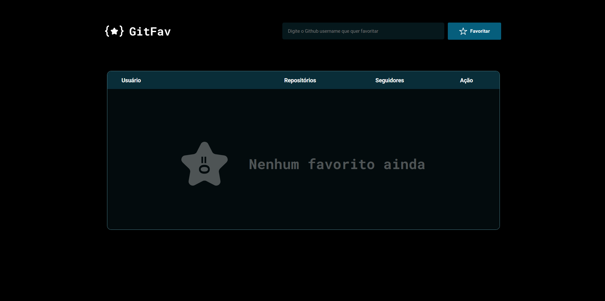
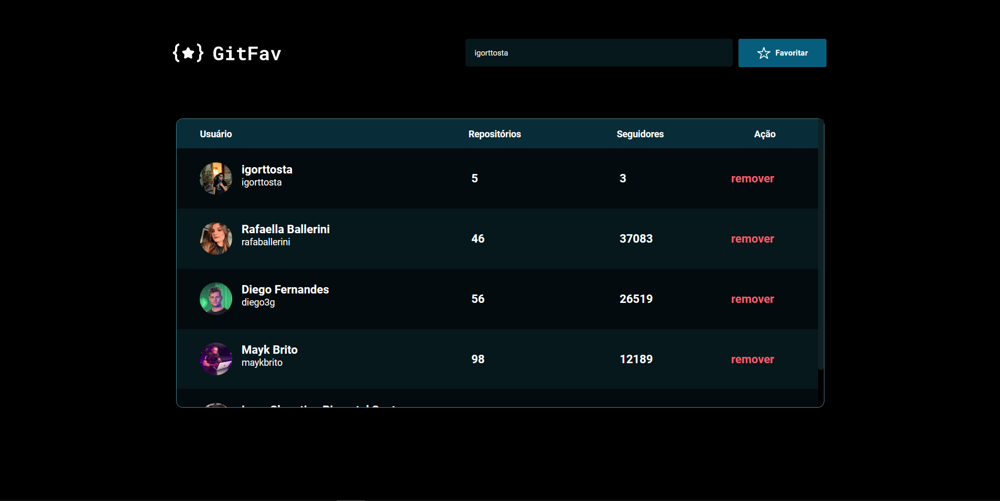

# 💻 Git Favs
### 🚀 Projeto desenvolvido após o término do Stage 6, do curso Explorer, da Rocketseat.

## 📚 Nele apliquei conhecimentos como:
- Programação orientada a objetos
- Single Page Application
- Node Package Manager
- HTML CSS e Javascript
- Responsividade para desktops grandes e pequenos

 

> Layout final da aplicação vazia e com vários usuários

